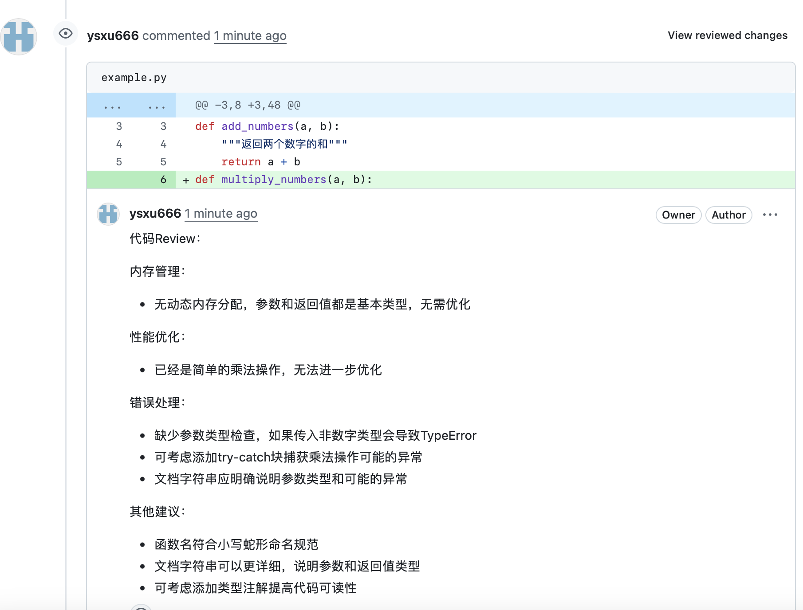

# 基于LLM的MR Reviewer
1. 随便自己创建一个简单的Gitlab repo即可，然后在该repo写一点简单的代码，提交一个MR到repo上。
2. MR Reviewer自动进行评审，提交comments。
几点要求：
每个MR提交的comments不超过3个。
Comments需要准确地评论在对应的代码行上（跟人工提交comments一个效果）。
Comments尽量合情合理。
## 目录结构
```
llm_mr_reviewer/
├── readme.md
├── requirements.txt
└── src
    ├── ai_code_reviewer.py        #实现了一个基于语法树解析和 AI 模型的代码分析工具，并通过 GitHub API 在代码审查中自动生成评论。
    ├── ai_code_reviewer_logger.py #日志模块
    ├── ai_module.py               #调用 AI 模型，对代码进行审查并生成优化建议
    ├── common_function.py         #校验参数是否为非空字符串，检查日志模块是否已正确初始化。
    ├── github_assistant.py        #与 GitHub API 交互，获取拉取请求（PR）的修改文件、解析差异文件的变更位置，并在 PR 中添加评论。
    └── prompt_level_configure.json
```

## 使用说明
1. llm_mr_reviewer项目推到github
2. 从github的Settings -> Developer Settings -> Personal access tokens中获取token
3. 新建一个仓库，创建.github/workflows/code_review.yml
```
name: "AI Code Reviewer Example"

on:
  pull_request:
    types: [opened, synchronize, reopened]

jobs:
  example:
    uses: ysxu666/llm_mr_reviewer/.github/workflows/code_review.yml@main   # 引用复用的工作流
    with:
      PULL_REQUEST_ID: ${{ github.event.pull_request.number }}
      COMMIT_ID: ${{ github.event.pull_request.head.sha }}
      SELF_HOSTED: 'ubuntu-latest'  # 若使用 self-host，请更改为对应的 label
    secrets:
      LLM_API_KEY: ${{ secrets.LLM_API_KEY }}
      LLM_API_URL: ${{ secrets.LLM_API_URL }}
      THIS_GITHUB_TOKEN: ${{ secrets.THIS_GITHUB_TOKEN }}
      REPOSITORY_NAME: ${{ github.event.repository.name }}
      REPOSITORY_OWNER: ${{ github.repository_owner }}
      PROMPT_LEVEL: ${{ secrets.PROMPT_LEVEL }}
```
4. 在仓库的settings -> secrets and variables的repository secrets中添加以下变量：
```
LLM_API_KEY=<your api key>
LLM_API_URL=https://api.deepseek.com
PROMPT_LEVEL=0
THIS_GITHUB_TOKEN=<your github token>
```
6. 新建一个example.py文件，并提交
```
# 文件名: example.py

def add_numbers(a, b):
    """返回两个数字的和"""
    return a + b

# 测试代码
if __name__ == "__main__":
    result = add_numbers(5, 3)
    print(f"The sum of 5 and 3 is: {result}")
```
6. 修改example.py文件，并提交到一个新的分支
```
# 文件名: example.py

def add_numbers(a, b):
    """返回两个数字的和"""
    return a + b
def multiply_numbers(a, b):
    """返回两个数字的乘积"""
    return a * b

def divide_numbers(a, b):
    """返回两个数字的商"""
    return a / b

def subtract_numbers(a, b):
    """返回两个数字的差"""
    return a - b

def power_numbers(a, b):
    """返回 a 的 b 次方"""
    return a ** b

def modulo_numbers(a, b):
    """返回两个数字的模"""
    return a % b

def square_root(a):
    """返回数字的平方根"""
    return a ** 0.5

# 测试代码
if __name__ == "__main__":
    result = add_numbers(5, 3)
    print(f"The sum of 5 and 3 is: {result}")
    result_multiply = multiply_numbers(5, 3)
    print(f"The product of 5 and 3 is: {result_multiply}")

    result_divide = divide_numbers(10, 2)
    print(f"The quotient of 10 and 2 is: {result_divide}")

    result_subtract = subtract_numbers(10, 5)
    print(f"The difference between 10 and 5 is: {result_subtract}")

    result_power = power_numbers(2, 3)
    print(f"2 to the power of 3 is: {result_power}")

    result_modulo = modulo_numbers(10, 3)
    print(f"The remainder of 10 divided by 3 is: {result_modulo}")

    result_sqrt = square_root(16)
    print(f"The square root of 16 is: {result_sqrt}")
```
提交新分支
```
git checkout -b new-branch
git add .
git commit -m "test"
git push origin new-branch
```

7. 提交一个merge request，并查看评论,最多只有3个评论




